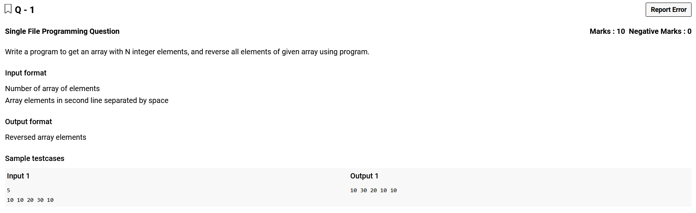
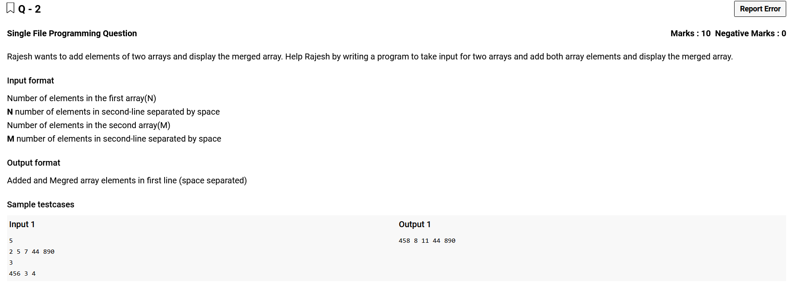
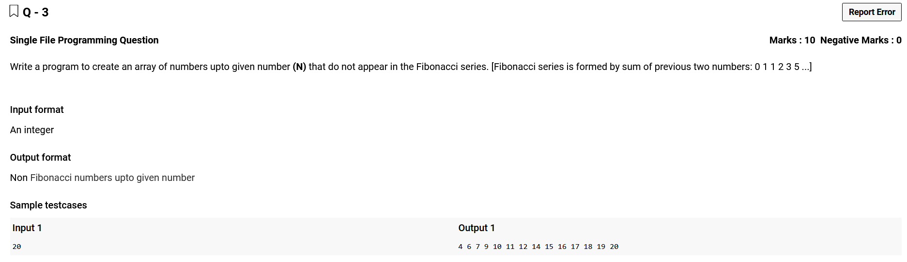
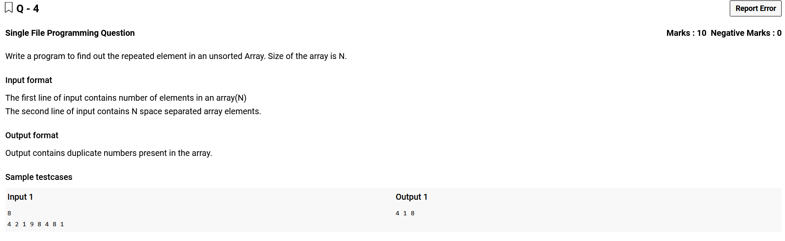
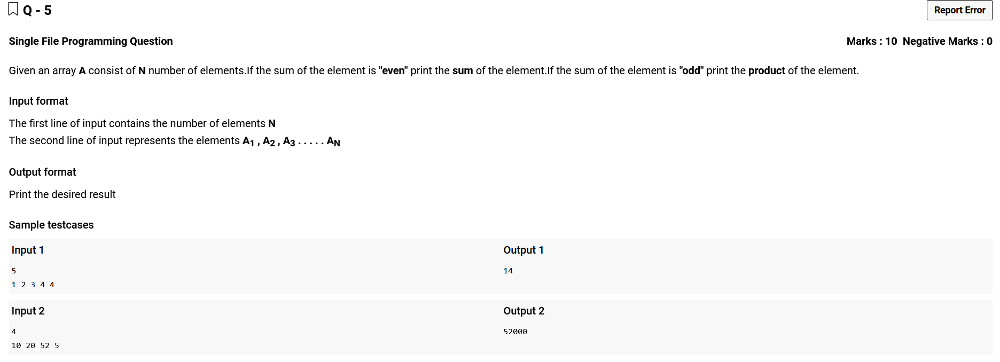
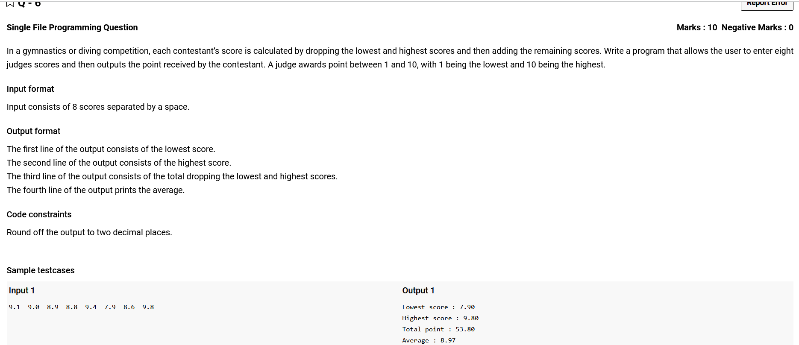
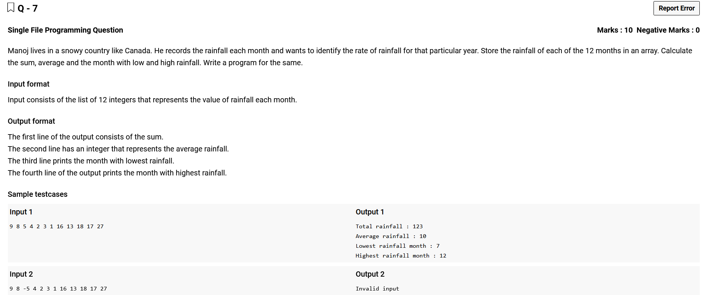
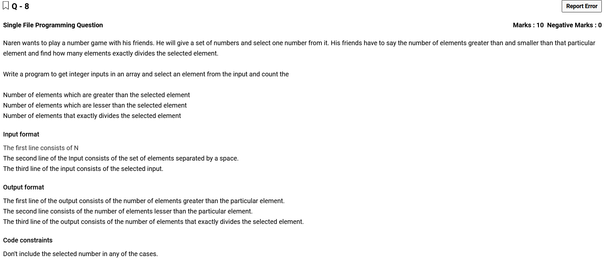
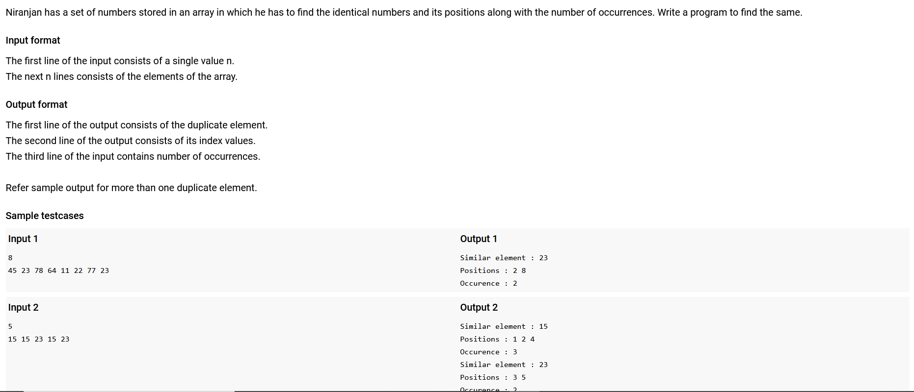
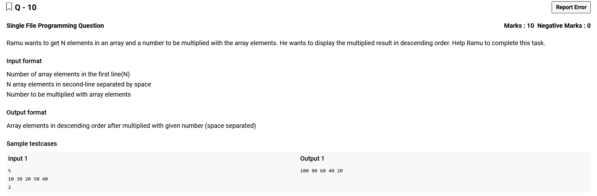

# 


```c
#include <stdio.h>
#include <stdlib.h>

void reverse(int* arr,int n){
    for(int i=0;i<(int)n/2;i++){
        arr[i]+=arr[n-i-1];
        arr[n-i-1]=arr[i]-arr[n-i-1];
        arr[i]-=arr[n-i-1];
    }
}

int main(){
    int n;
    scanf("%d",&n);
    
    int *arr;
    arr=(int*) calloc(n,sizeof(int));
    
    for(int i=0;i<n;i++)
        scanf("%d",arr+i);
    
    reverse(arr,n);
    for(int i=0;i<n;i++)
        printf("%d ",arr[i]);
        
        
}
```

# 


```c
#include <stdio.h>
#include <stdlib.h>

void getArray(int* arr,int n){
    for(int i=0;i<n;i++)
        scanf(" %d ",arr+i);
}

void display(int* arr,int n){
    for(int i=0;i<n;i++)
        printf("%d ",arr[i]);
    printf("\n");
}

int* add(int* arrL,int* arrS,int arrSN){
    for(int i=0;i<arrSN;i++)
        arrL[i]+=arrS[i];
    return arrL;
}

int main(){
    int fn,sn,*fa,*sa;
    
    scanf("%d",&fn);
    fa = (int*)calloc(fn,sizeof(int));
    getArray(fa,fn);
    
    scanf("%d",&sn);
    sa = (int*)calloc(sn,sizeof(int));
    getArray(sa,sn);
    
    //display(fa,fn);
    //display(sa,sn);

    if(fn>=sn)
        display(add(fa,sa,sn),fn);
    else
        display(add(sa,fa,fn),sn);
    
}
```

# 


```c
#include <stdio.h>

int main(){
    int n;
    scanf("%d",&n);
    
    int fibs[n+1]={1,1};
    
    int f=0,s=1,t=1;
    
    
    for(int i=0;i<=n;i++){
        t=f+s;
        //printf("%d",t);
        if(t<=n) fibs[t]=1;
        else break;
        f=s;s=t;
    }
    
    for(int i=0;i<=n;i++){
        //printf("%d ",fibs[i]);
        if(!fibs[i]) printf("%d ",i);
    }
}
```

# 


```c
#include <stdio.h>

int find(int* set,int from,int set_n,int element){
    for(int i=from+1;i<set_n;i++)
        if(set[i]==element)
            return 1;
    return 0;
}

int main(){
    int n;
    scanf("%d",&n);
    
    int nums[n];
    for(int i=0;i<n;i++)
        scanf(" %d ",&nums[i]);


    int rep[n];
    int rep_n=0;
    
    for(int i=0;i<n;i++){

        if(find(rep,0,rep_n,nums[i]) != 1){//find if current element is not in repeated set
            //printf("Entered if : %d\n",nums[i]);
            if(find(nums,i,n,nums[i])){//find if element is not in repeated set
                //printf("Entered Nested if : %d\n\n",nums[i]);
                rep[rep_n]=nums[i];
                rep_n++;
            }
        }
    }

    for(int i=0;i<rep_n;i++){
        printf("%d ",rep[i]);
    }
}
```

# 


```c
#include <stdio.h>

int main(){
    int n,sum=0,prod=1;
    scanf("%d",&n);
    
    int arr[n];
    for(int i=0;i<n;i++)
        scanf("%d",&arr[i]);
    
    for(int i=0;i<n;i++){
        //printf("%d ",arr[i]);
        sum+=arr[i];
        prod*=arr[i];
    }
    
    printf("%d",(sum%2)?prod:sum);
}
```

# 


```c
#include <stdio.h>

int main(){
    float num[8];
    for(int i=0;i<8;i++)
        scanf(" %f ",&num[i]);
        
    float low=10.0,high=1.0,tot=0,avg;
    for(int i=0;i<8;i++){
        if(num[i]>=high)
            high=num[i];
        if(num[i]<=low)
            low=num[i];
        tot+=num[i];
        
    }
    tot-=(high+low);
    avg = tot/6;
    printf("Lowest score : %.2f\nHighest score : %.2f\nTotal point : %.2f\nAverage : %.2f",low,high,tot,avg);
}
```

# 


```c
#include <stdio.h>

int main(){
    int rain[12],flag=0;
    for(int i=0;i<12;i++){
        scanf("%d",&rain[i]);
        if(rain[i]<0) flag=1;
    }
        
    if(flag){
        printf("Invalid input");
        return 0;
    }
    int tot=0,low=1000,high=-1,lm,hm;//Arbitary Low & High
    for(int i=0;i<12;i++){
        if(rain[i]<low) {
            low=rain[i];
            lm=i+1;
        }
        if(rain[i]>high){
            high=rain[i];
            hm=i+1;
        }
        tot+=rain[i];
    }
    
    printf("Total rainfall : %d\n",tot);
    printf("Average rainfall : %d\n",tot/12);
    printf("Lowest rainfall month : %d\n",lm);
    printf("Highest rainfall month : %d",hm);
}
```

# 


```c
#include <stdio.h>

int main(){
    int hn=0,ln=0,dn=0;
    int n;
    scanf(" %d ",&n);
    
    int arr[n];
    for(int i=0;i<n;i++)
        scanf(" %d ",&arr[i]);
        
    int d;
    scanf("%d",&d);
    
    for(int i=0;i<n;i++){
        if(arr[i]==d) continue;
        
        if(d%arr[i]==0) dn++;
        
        if(arr[i]>d) hn++;
        else ln++;
    }
    
    printf("Greater : %d\n",hn);
    printf("Lesser : %d\n",ln);
    printf("Exactly divides : %d",dn);
    
}
```

# 


```c
// You are using GCC
#include <stdio.h>
#include <stdlib.h>

typedef struct Node{
    int ele;
    int re;
    Node* next;
    int *pos;
}node;

node* create(int element,int pos){
    node* elem = (node*) malloc(sizeof(node)+sizeof(int[6]));
    elem->ele=element;
    elem->pos=(int*)malloc(sizeof(int[6]));
    elem->re=0;
    elem->pos[(elem->re)++]=pos;
    elem->next=NULL;
    return elem;
}

void insert(node* head,int element,int p){
    while(head->next!=NULL || head->ele==element){
        if(head->ele==element){
            head->pos[(head->re)++]=p;
            return;
        }
        head=head->next;
    }
    head->next=create(element,p);
}

void display(node* head){
    for(node* i=head;i!=NULL;i=i->next)
        if(i->re>1){
            printf("Similar element : %d\n",i->ele);
            printf("Positions :");
            for(int j=0;j<i->re;j++)
                printf(" %d",i->pos[j]);
            printf("\n");
            printf("Occurence : %d\n",i->re);
        }
}

int main(){
    int n;
    scanf("%d",&n);
    int arr[n];
    
    for(int i=0;i<n;i++)
        scanf("%d",&arr[i]);
    
    node* head = create(arr[0],1);
    
    for(int i=1;i<n;i++)
        insert(head,arr[i],i+1);
        
    display(head);
}
```

# 


```c
// You are using GCC
#include <stdio.h>
#include <stdlib.h>

int compare(const void *a,const void *b) { return *(int*)b - *(int*)a;}

int main(){
    int n,mul;
    scanf(" %d ",&n);
    
    int arr[n];
    for(int i=0;i<n;i++)
        scanf(" %d ",&arr[i]);
    scanf("%d",&mul);
    
    for(int i=0;i<n;i++)
        arr[i]*=mul;
    
    qsort(arr,n,sizeof(int),compare);
    
    for(int i=0;i<n;i++)
        printf("%d ",arr[i]);
}
```
