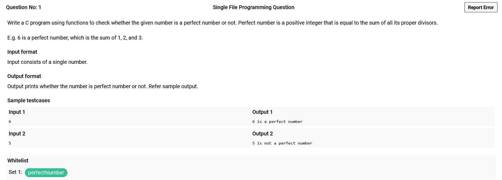
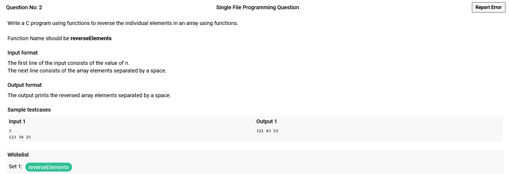
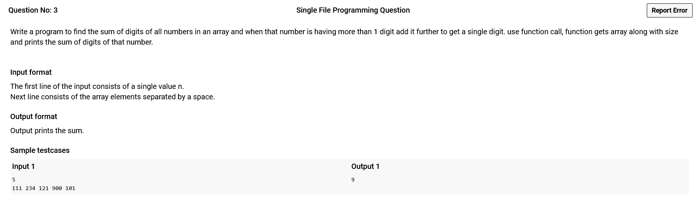
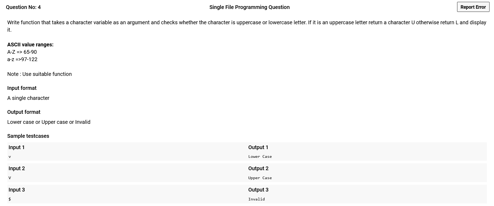
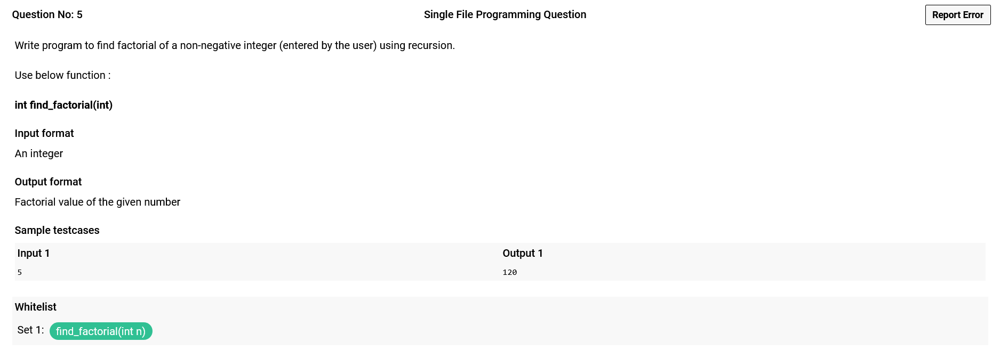
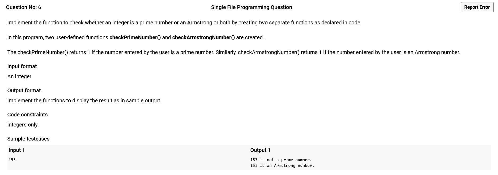

# 


--------------
```C
#include<stdio.h>
int perfectNumber(int n) {
    int sum=0;
    for(int i=1;i<n;i++)
        if(n%i==0)
            sum+=i;
            
    return sum==n;
}
int main()
{
   int n;
   scanf("%d",&n);
   perfectNumber(n);
   printf("%d is %sa perfect number",n,(perfectNumber(n))?"":"not ");
   return 0;
}
```
--------------

# 


--------------
```C
#include <stdio.h>

void reverseElements(int n,int* arr){
    for(int i=0;i<n;i++){
        int rev = 0;
        int num = arr[i];
        while(num){
            rev*=10;
            rev+=num%10;
            num/=10;
        }
        arr[i]=rev;
    }
}

int main(){
    int n;
    scanf("%d",&n);
    int arr[n];
    for(int i=0;i<n;i++) scanf(" %d ",&arr[i]);
    reverseElements(n,arr);
    for(int i=0;i<n;i++) printf("%d ",arr[i]);
}

```
--------------

# 


--------------
```C
#include<stdio.h>

int sumOfNum(int num,int prev){
    int ds = prev;
    while(num){
        ds+=num%10;
        //printf("%d %d %d\n",num,prev,ds);
        if(ds>10) ds = sumOfNum(ds,0);
        num/=10;
    }
    return ds;
}

int sum(int a[],int n){
    int soa=0; 
    for(int i=0;i<n;i++){
        soa=sumOfNum(a[i],soa);
    }
    return soa;
}
int main()
{
    int n,i;
    scanf("%d",&n);
    int a[n];
    for(int i=0;i<n;i++) scanf("%d",&a[i]);
    printf("%d",sum(a,n));
}
```
--------------

# 


--------------
```C
#include <stdio.h>
#include <stdlib.h>

char check(char c)
{
    if(c>='a' && c<='z') return 'L';
    else if(c>='A' && c<='Z') return 'U';
    else return 'I';
}

int main()
{
    char t;
    scanf("%c",&t);
    switch(check(t)){
        case 'L' : printf("Lower Case");break;
        case 'U' : printf("Upper Case");break;
        case 'I' : printf("Invalid");
    }
    return 0;
}
```
--------------

# 


--------------
```C
#include <stdio.h>


int find_factorial(int n){
    return (!n)?1:n*find_factorial(n-1);
}

int main(){
    int n;
    scanf("%d",&n);
    printf("%d",find_factorial(n));
}
```
--------------

# 

--------------
**Already Given in Snippet :**
```C
    #include <stdio.h>
    #include <math.h>
    int checkPrimeNumber(int n);
    int checkArmstrongNumber(int n);
    int main()
    {
        int n, flag;
        scanf("%d", &n);
        // Check prime number
        flag = checkPrimeNumber(n);
        if (flag == 1)
            printf("%d is a prime number.\n", n);
        else
            printf("%d is not a prime number.\n", n);

        // Check Armstrong number
        flag = checkArmstrongNumber(n);
        if (flag == 1)
            printf("%d is an Armstrong number.", n);
        else
            printf("%d is not an Armstrong number.",n);
        return 0;
    }
```
**Written Code :**
```C
int checkPrimeNumber(int n){
    if(n==2) return 1;
    if(n==1 || n%2==0) return 0;
    for(int i=3;i<=sqrt(n);i+=2) 
        if(n%i==0) return 0;
    return 1;
}

int checkArmstrongNumber(int n){
    int sum=0,t=n,r;
    while(t){
        r=t%10;
        sum+=r*r*r;
        t/=10;
    }
    return sum==n;
}
```
--------------
