# 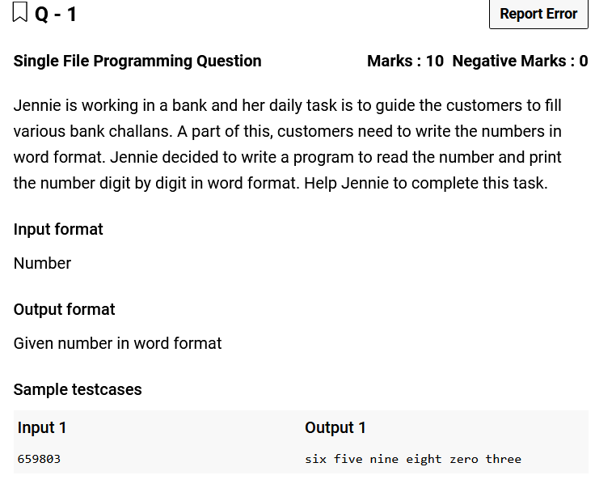


```C
#include <stdio.h>
#include <string.h>
#include <stdlib.h>

int main(){
    char numToWord[10][6]= {"zero","one","two","three","four","five","six","seven","eight","nine"};
    char* num = (char*) malloc(50);
    gets(num);
    //int i=0;
    //printf("%d %s",strlen(num),num);
    while(*(num)!='\0')
        printf("%s ",numToWord[*(num++)-'0']);
}
```

# 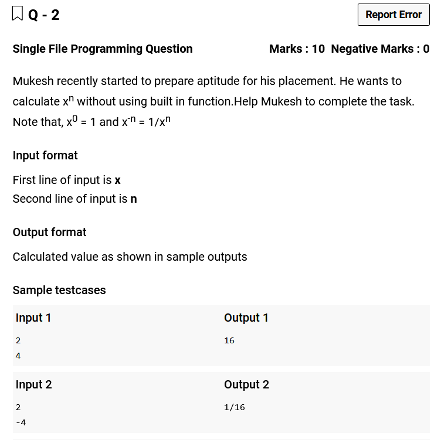


```C
#include <stdio.h>

int main(){
    int x,n,isNeg=0;
    scanf("%d %d",&x,&n);
    
    if(n==0) {printf("1");return 0;}
    if(n<0) {isNeg=1;n=-n;}
    
    int ox = x;
    for(int i=1;i<n;i++)
        x*= ox;
    
    if(!isNeg) printf("%d",x);
    else printf("1/%d",x);
}
```

# 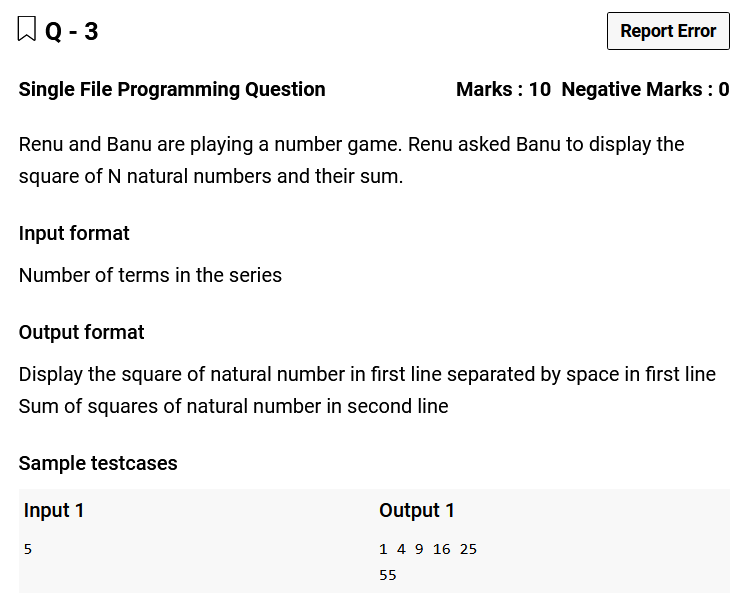


```C
#include <stdio.h>

int main(){
    int n,sum=0;
    scanf("%d",&n);
    
    for(int i = 1;i<=n;i++){
        printf("%d ",i*i);
        sum += i*i;
    }
    
    printf("\n%d",sum);
    
}
```

# 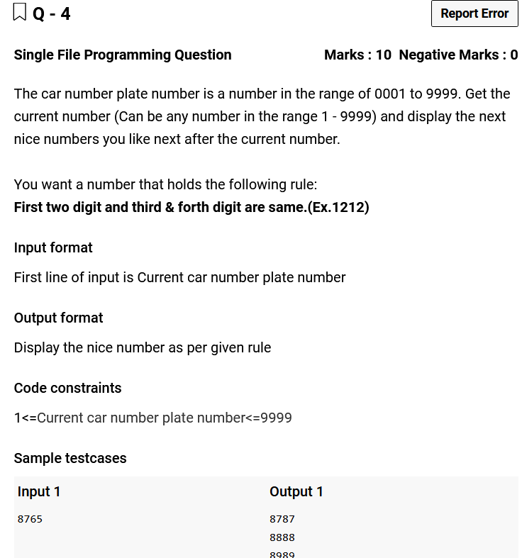


```C
#include <stdio.h>

int main(){
    int num;
    scanf("%d",&num);
    int f=num/100,s=num%100;
    
    if(f>=s) num = f*100+f;
    else num = num + (101 - (s-f));
    
    //printf("%d\n",num);
    while(num<=9999){
        printf("%d\n",num);
        num+=101;
    }
}
```

# 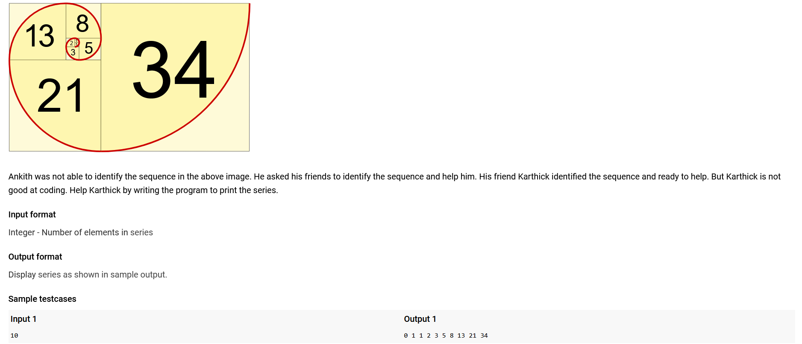


```C
// You are using GCC
#include <stdio.h>

int main(){
    int p2=0,p1=1,c,n;
    scanf("%d",&n);
    
    printf("%d %d ",p2,p1);
    
    //Using two variables
    for(n-=2;n>0;n--){
        printf("%d ",p1=p2+p1);
        p2 = p1-p2;
    }
    
    //Using three variables
    /*
    for(n-=2;n>0;n--){
        c=p2+p1;
        printf("%d ",c);
        p2=p1;
        p1=c;
    }
    */
}

```

# 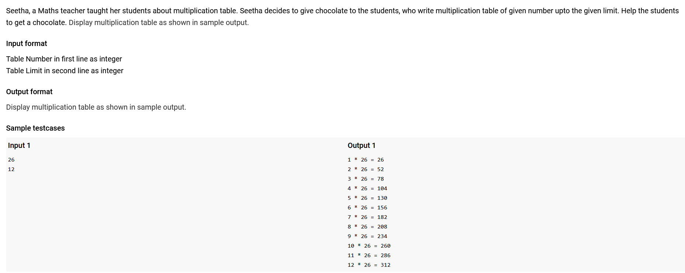


```C
// You are using GCC
#include <stdio.h>

int main(){
    int a,n;
    scanf("%d %d",&a,&n);
    
    for(int i=1;i<=n;i++)
        printf("%d * %d = %d\n",i,a,i*a);
}
```

# 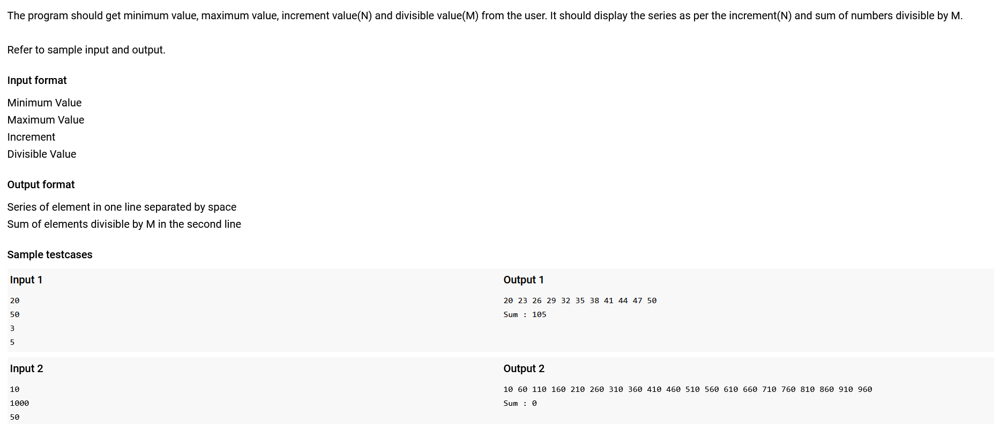


```C
// You are using GCC
#include <stdio.h>

int main(){
    int min,max,inc,divi,sum=0;
    scanf("%d %d %d %d",&min,&max,&inc,&divi);
    
    for(min;min<=max;min+=inc){
        printf("%d ",min);
        if(min%divi == 0) sum+=min;
    }
    
    printf("\nSum : %d",sum);
}
```

# 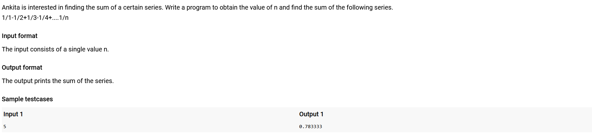


```C
// You are using GCC
#include <stdio.h>

int main(){
    int n;
    scanf("%d",&n);
    double sum=0;
    
    for(int x=1;x<=n;x++){
        if(x%2) sum+=(double)1/x;
        else sum-=(double)1/x;
    }
        
    printf("%lf",sum);
}
```

# 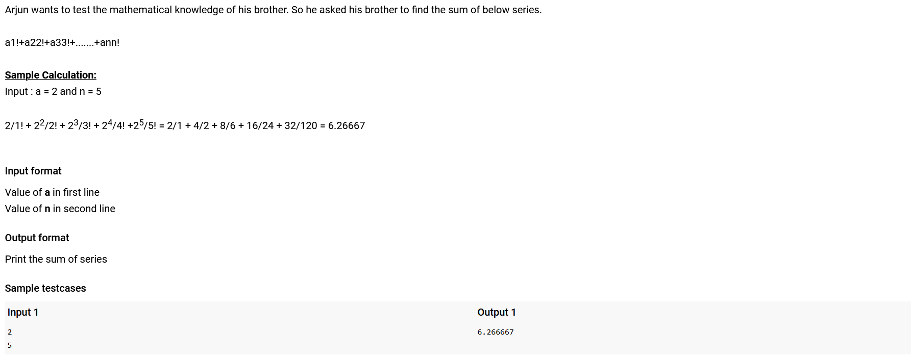


```C
// You are using GCC
#include <stdio.h>
#include <math.h>

int main(){
    float fact=1,sum=0,n,a;
    scanf("%f %f",&a,&n);
    
    for(float i=1;i<=n;i++){
        fact*=i;
        sum+=pow(a,i)/fact;
    }
    
    printf("%f",sum);
}
```

# 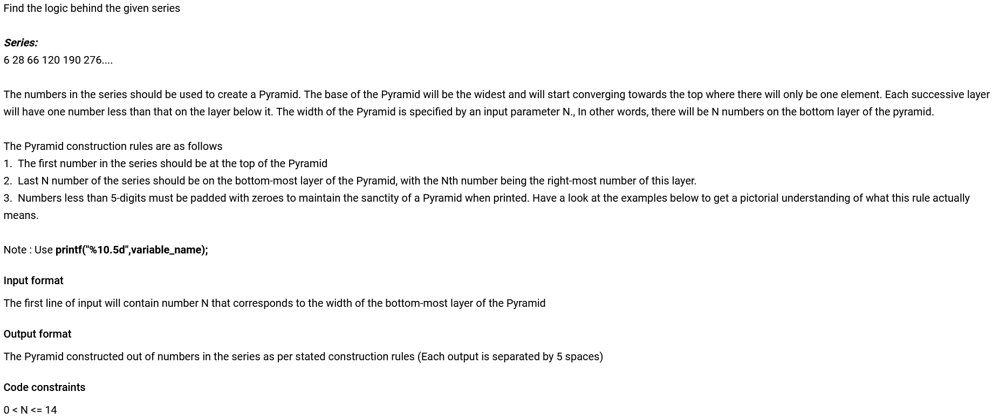


```C
// You are using GCC
#include <stdio.h>

int main(){
    int ini=2,n;
    scanf("%d",&n);
    
    for(int i=1;i<=n;i++){
        for(int j=1;j<=i;j++){
            printf("%10.5d",ini*((2*ini)-1));
            ini+=2;
        }
        printf("\n");
    }
}
```

# 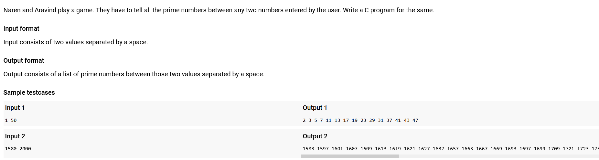


```C
// You are using GCC
#include <stdio.h>
#include <math.h>

int isPrime(int n){
    if(n<2) return 0;
    if(n==2) return 1;
    
    for(int i=3;i<=sqrt(n);i+=2)
        if(n%i == 0) 
            return 0;

    return 1;
}

int main(){
    int start,stop;
    scanf("%d %d",&start,&stop);
    
    if(start<=2) {
        printf("2 ");
        start=3;
    }
    
    if(start%2==0) start++;
    
    for(int i=start;i<=stop;i+=2)
        if(isPrime(i)) printf("%d ",i);
}
```

# 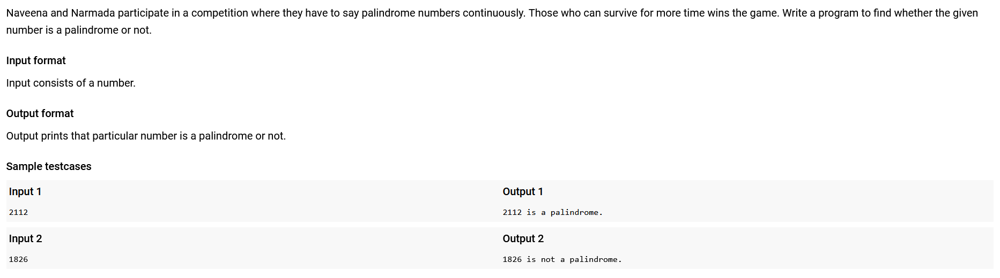


```C
// You are using GCC
#include <stdio.h>

int palindrome(int n){
    int rn=0,tn=n;
    while(tn>0){
        rn*=10;
        rn+=tn%10;
        tn/=10;
    }
    return (rn==n)?1:0;
}

int main(){
    int num;
    scanf("%d",&num);
    
    if(palindrome(num)) printf("%d is a palindrome.",num);
    else printf("%d is not a palindrome.",num);
}
```

# 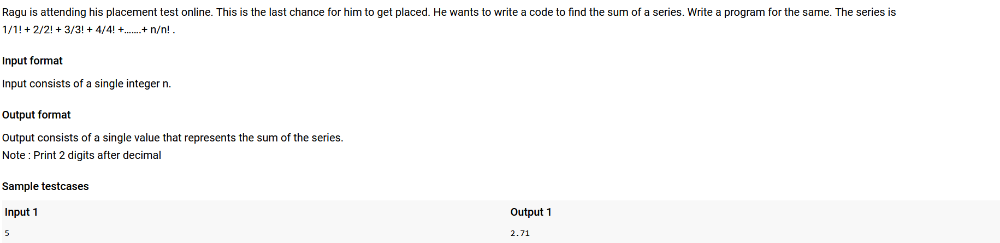


```C
// You are using GCC
#include <stdio.h>

int main(){
    int n,fact=1;
    float sum=0;
    scanf("%d",&n);
    
    for(int i=1;i<=n;i++)
        sum+=(float)i/(fact*=i);
        
    printf("%.2f",sum);
}
```

# 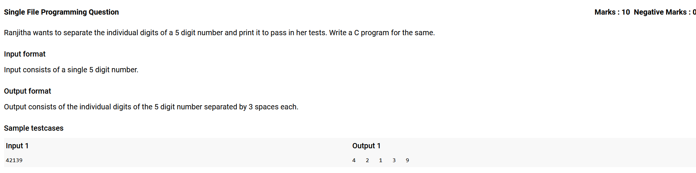


```C
// You are using GCC
#include <stdio.h>

int main(){
    char num[6];
    gets(num);
    
    for(int i=0;i<5;i++)
        printf("%c   ",num[i]);
}
```

# 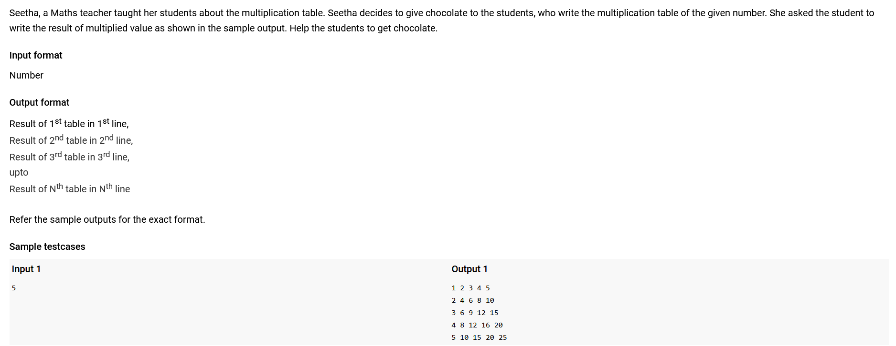


```C
// You are using GCC
#include <stdio.h>

int main(){
    int n;
    scanf("%d",&n);
    
    for(int i=1;i<=n;i++){
        for(int j=1;j<=n;j++)
            printf("%d ",i*j);
        printf("\n");
    }    
}
```
