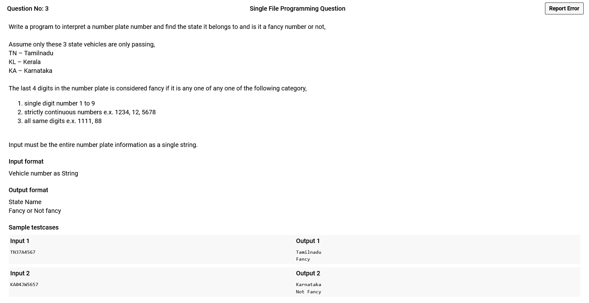
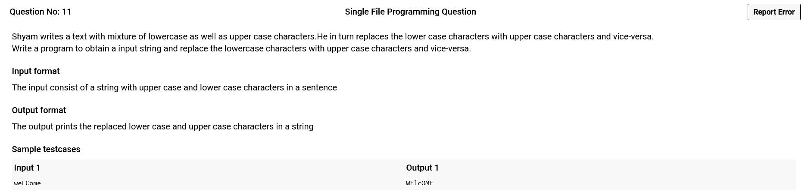

# 

------------------------------------------------------------------------

```c
#include <stdio.h>
#include <string.h>

int main(){
    char speakForiegn[4],department[4],masterDegree[4],phd[4];
    int salary,yearsOfWork;
    float payIncrease=0.25;
    
    scanf(" %d ",&salary);
    gets(speakForiegn);
    gets(department);
    scanf(" %d ",&yearsOfWork);
    gets(masterDegree);
    gets(phd);
    
    //printf("Depart : %s\n",department);
    //printf("MD : %s\n",masterDegree);
    switch(department[0]){
        case 'A': 
            payIncrease += (yearsOfWork>=5)?0.05:0.0;
            break;
        case 'T': 
            payIncrease += (masterDegree[0] == 'Y')?0.03:0.0;
            payIncrease += (phd[0] == 'Y')?0.1:0.0;
            break;
    }
    
    payIncrease += (speakForiegn[0] == 'Y')?0.02:0.0;
    
    //printf("%f\n",payIncrease);
    printf("%.6f",salary+(salary*payIncrease));
}
```

------------------------------------------------------------------------

# 

------------------------------------------------------------------------

```c
#include <stdio.h>
#include <string.h>

int main(){
    int hasDot = 1,isValid=1,n,dc=0,uc=0,lc=0,current;
    char userID[100];
    
    gets(userID);
    n=strlen(userID);
    for(int i=0;i<n;i++){
        current = userID[i];
        if(current>='0' && current<='9'){
            dc++;
            hasDot=0;
            continue;
        }
        if(current>='a' && current<='z'){
            lc++;
            hasDot=0;
            continue;
        }
        if(current>='A' && current<='Z'){
            uc++;
            hasDot=0;
            continue;
        }
        if(current =='.' && i!=n-1 && !hasDot){
            hasDot=1;
            continue;
        }
        isValid=0;
    }
    
    isValid= uc && lc && dc && isValid;
    printf("%s is %s",userID,(isValid)?"Valid":"Invalid");
}
```

------------------------------------------------------------------------

# 

------------------------------------------------------------------------

```c
#include <stdio.h>
#include <string.h>
#include <ctype.h>

int isFancy(int num){
    if(num>=0 && num<=9) return 1;
    
    int isSame = 1, isIncFancy = 1;
    const short int tempS=num%10;
    short int temp,tempF=tempS;
    
    while(num/=10){
        temp=num%10;
        
        isSame = isSame && (tempS==temp);
        isIncFancy = isIncFancy && (temp==tempF-1);
        
        tempF=temp;
    }
    return isSame||isIncFancy;
}

int main(){
    char numplate[69];
    gets(numplate);
    
    char city[] = {numplate[0],numplate[1],'\0'}; //State Name Extraction
    
    if(strcmp(city,"TN")==0) printf("Tamilnadu");
    else if(strcmp(city,"KL")==0) printf("Kerala");
    else printf("Karnataka");
    printf("\n");
    
    int fancy=0, num=0, inc=1, n=strlen(numplate);
    for(int i=n-1;i>=n-4;i--){ //from end to end-4 
        if(isdigit(numplate[i])==0) break; //encountering first non digit : terminate
        num+=(numplate[i]-'0')*inc;//The current number is multipied with powers of 10
        inc*=10;
    }
    
    printf("%s",(isFancy(num))?"Fancy":"Not Fancy");
}
```

------------------------------------------------------------------------

# 

------------------------------------------------------------------------

```c
#include <stdio.h>
int digit(char c) { return c-'0';}

int main(){
    char mon[][10] = {"January","February","March","April","May","June",
                    "July","August","September","October","November","December"};
    char ex[10];
    gets(ex);
    
    short int d = digit(ex[7])*10 + digit(ex[8]);
    short int m = digit(ex[5])*10 + digit(ex[6]);
    short int y = 2000 + digit(ex[3])*10 + digit(ex[4]);
    
    printf("Day: %d\n",d);
    printf("Month: %s\n",mon[m-1]);
    printf("Year: %d",y);

}
```

------------------------------------------------------------------------

# 

------------------------------------------------------------------------

```c
#include <stdio.h>

int main(){
    char name[20],gender[7];
    int day,month;
    
    gets(name);
    scanf(" %d:%d:%*d ",&day,&month);
    gets(gender);
    month = (gender[0]=='F')?month+50:month;
    
    printf("%c%02d%02d",name[0],day,month);
    
    //Still don't know why would/should I use sprintf and keep the damn thing on memory
    //or convert it to int to string ??????
}
```

------------------------------------------------------------------------

# 

------------------------------------------------------------------------

```c
#include <stdio.h>
#include <string.h>
#include <stdlib.h>
#define MAX 50
typedef struct Node{
    struct Node* next;
    char* word;
}Node;

void insert(Node** Head,char* word){
    Node *temp = (Node*)calloc(1,sizeof(Node));
    temp->next = NULL;
    temp->word = (char*) calloc(strlen(word),sizeof(char));
    strcpy(temp->word,word);
    
    if(*Head == NULL){
        *Head = temp;
        return;
    }
    
    Node* curr = NULL;
    do{
        curr = (curr==NULL)?*Head:curr->next;
        if(strcmp(curr->word,word)==0){
            free(temp);
            return;
        }
    }while(curr->next!=NULL);
    
    curr->next = temp;
}

void removeDuplicateLL(char* sentence){
    Node* Words = NULL;
    
    for(char* t=sentence;(t=strtok(t," \n"))!=NULL;t=NULL)
        insert(&Words,t);
    
    for(Node* i=Words;i!=NULL;i=i->next)
        printf("%s ",i->word);
}

int main(){
    char sentence[MAX*50] = {0}; //arbitary length
    fgets(sentence,MAX*50,stdin);
    removeDuplicateLL(sentence);
    
    //scanf("%[^\n]s",sentence);
    //removeDuplicateNew(sentence);
}
```

------------------------------------------------------------------------

# 

------------------------------------------------------------------------

```c
#include <stdio.h>
#include <stdlib.h>
#include <string.h>

void replace(char* str, char* tar){
    char* ptr;
    while(1){
        ptr = strstr(str,tar);
        if(ptr==NULL) return;
        memset(ptr,'~',strlen(tar));
    }
}

int main(){
    char *sen = (char*) calloc(500,sizeof(char));
    fgets(sen,500,stdin);
    
    replace(sen,"The");
    replace(sen,"An");
    replace(sen,"A");
    replace(sen,"the");
    replace(sen,"an");
    replace(sen,"a");
    
    for(int i=0;i<strlen(sen);i++)
        if(sen[i]!='~') printf("%c",sen[i]);
}
```

------------------------------------------------------------------------

# 

------------------------------------------------------------------------

```c
#include <stdio.h>
#include <stdlib.h>
#include <string.h>

typedef struct Node{
    char c;
    struct Node* left;
    struct Node* right;
}Node;

Node* create(char c){
    Node* node = (Node*) calloc(1,sizeof(Node));
    node->c = c;
    node->left = NULL;
    node->right = NULL;
    return node;
}

Node* insert(Node* node,char c){
    if (node==NULL) return create(c);
    
    if(c <= node->c) node->left = insert(node->left,c);
    else node->right = insert(node->right,c);
    
    return node;
}

void inorder(Node* node){
    if(node==NULL) return;
    
    inorder(node->left);
    printf("%c",node->c);
    inorder(node->right);
}

int main(){
    char* sen = (char*) calloc(80,sizeof(char));
    fgets(sen,80,stdin);
    Node* head = NULL;
    for(int i=0;i<strlen(sen);i++)
        head=insert(head,sen[i]);
    inorder(head);
}
```

------------------------------------------------------------------------

# 

------------------------------------------------------------------------

```c
#include <stdio.h>
#include <string.h>
#include <stdlib.h>
#include <time.h>

void countSpace(char *sen){
    //Count the number of spaces between words, 
    int spaces = 0;
    for(int i=0;i<strlen(sen);i++)
        if(sen[i]==' ') spaces++;
    //n(space) = n(words)-1
    printf("%d",spaces+1);
}

void countWords(char* sen){
    //Using strtok() [string tokenising] 
    int words=0;
    for(char* t=sen;(t=strtok(t," "))!=NULL;t=NULL)
        words++;
    printf("%d",words);
}

int main(){
    char *sen = (char*) calloc(500,sizeof(char));
    fgets(sen,500,stdin);
    
    srand(time(0));
    (rand()%2)?countSpace(sen):countWords(sen); // Randomly select methods
}
```

------------------------------------------------------------------------

# 

------------------------------------------------------------------------

```c
#include <stdio.h>
#include <string.h>
#include <stdlib.h>

int main(){
    char *pass = (char*) calloc(500,sizeof(char));
    fgets(pass,500,stdin);
    for(int i=0;i<strlen(pass);i++){
        if(pass[i]=='A') pass[i]='B';
        if(pass[i]=='a') pass[i]='@';
        if(pass[i]=='1') pass[i]='2';
    }
    printf("%s",pass);
}
```

------------------------------------------------------------------------

# 

------------------------------------------------------------------------

```c
#include <stdio.h>
#include <string.h>

int main(){
    char string[400]={0};
    fgets(string,400,stdin);
    
    for(int i=0;i<strlen(string);i++){
        if(string[i]>='A' && string[i]<='Z') string[i]+=32;
        else if(string[i]>='a' && string[i]<='z') string[i]-=32;
        else continue;
    }
    
    printf("%s",string);
}
```

------------------------------------------------------------------------

# 

------------------------------------------------------------------------

```c
#include <stdio.h>

int main(){
    char cus[600];
    scanf("%s",cus);
    printf("Hello %s! Welcome to Sunrise Basket",cus);
}
```

------------------------------------------------------------------------

